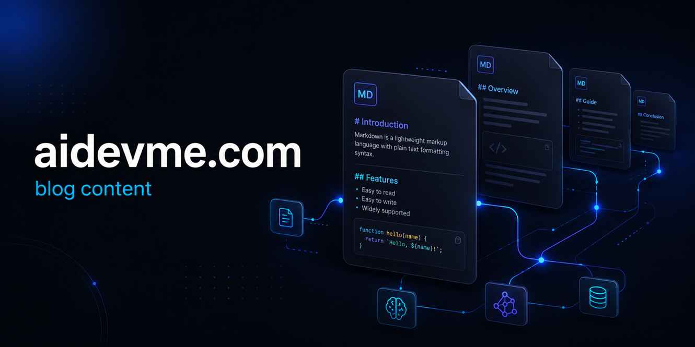

# aidevme-blog-content



Content repository for [aidevme.com](https://aidevme.com) — all blog articles in Markdown format with their associated assets.

---

## Overview

This repository is the single source of truth for all published and draft blog content on aidevme.com. Each article lives in its own self-contained directory under `articles/`, co-located with any images, animated GIFs, diagrams, and other media it references.

---

## Repository Structure

```
aidevme-blog-content/
├── articles/
│   └── <article-slug>/
│       ├── index.md          # Article content in Markdown
│       └── assets/
│           ├── hero.png      # Hero / cover image
│           ├── diagram.svg   # Architecture or flow diagrams
│           ├── screenshot.png
│           └── animation.gif
├── README.md
└── LICENSE
```

### Key conventions

| Path | Purpose |
|---|---|
| `articles/<slug>/index.md` | Full article content in Markdown |
| `articles/<slug>/assets/` | All media files used by that article |

- **`<slug>`** matches the URL path on aidevme.com (e.g., `how-to-build-an-mcp-server` → `https://aidevme.com/how-to-build-an-mcp-server`).
- Image references inside `index.md` use relative paths: ``.
- Each article directory is fully self-contained — no cross-article asset sharing.

---

## Article Format

Each `index.md` file starts with a YAML front matter block followed by the article body:

```markdown
---
title: "Article Title"
slug: article-slug
date: YYYY-MM-DD
tags: [tag1, tag2]
description: "Short description shown in previews and SEO meta tags."
cover: assets/hero.png
---

Article body in standard Markdown...
```

### Supported front matter fields

| Field | Required | Description |
|---|---|---|
| `title` | Yes | Full article title |
| `slug` | Yes | URL-safe identifier, matches the folder name |
| `date` | Yes | Publication date (`YYYY-MM-DD`) |
| `tags` | No | Array of topic tags |
| `description` | Yes | SEO meta description (≤ 160 characters) |
| `cover` | No | Relative path to the cover image |

---

## Assets Guidelines

| Asset type | Accepted formats | Notes |
|---|---|---|
| Photos / screenshots | `.png`, `.jpg`, `.webp` | Prefer `.webp` for smaller file size |
| Animated content | `.gif`, `.webp` | Animated `.webp` preferred over `.gif` |
| Diagrams / illustrations | `.svg`, `.png` | `.svg` preferred for crisp scaling |
| Code-heavy diagrams | `.svg` (Mermaid export) | Generate from Mermaid source in the article |

- Keep individual asset files **under 1 MB** where possible.
- Use descriptive, lowercase, hyphenated filenames: `auth-flow-diagram.svg`, not `image1.png`.
- Do not store binary assets (`.zip`, `.pdf`, fonts) in this repo.

---

## Contributing / Adding an Article

1. Create a new branch: `git checkout -b article/<slug>`
2. Create the article directory: `articles/<slug>/`
3. Add `index.md` with required front matter.
4. Place all media in `articles/<slug>/assets/`.
5. Verify all image paths in the Markdown resolve correctly.
6. Open a pull request targeting `main`.

---

## License

See [LICENSE](LICENSE) for details.
