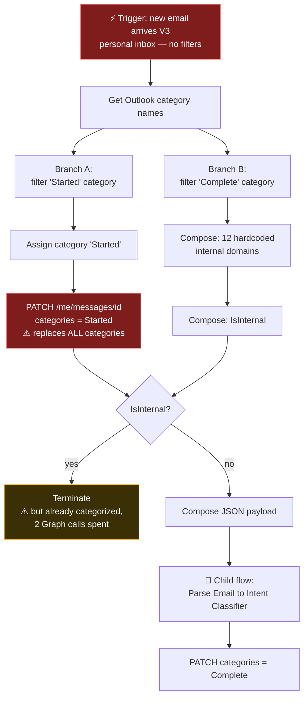
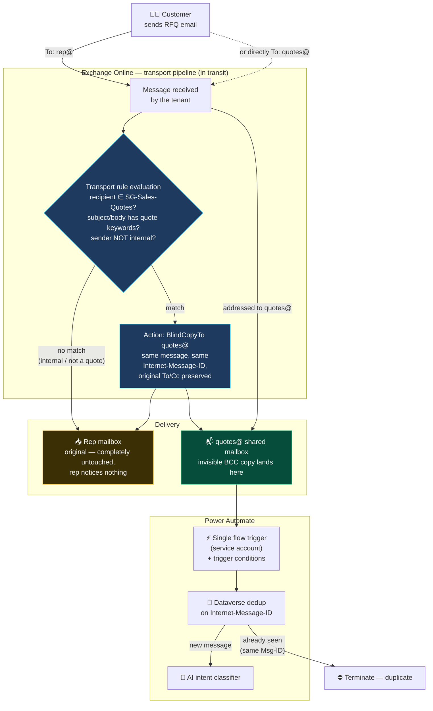
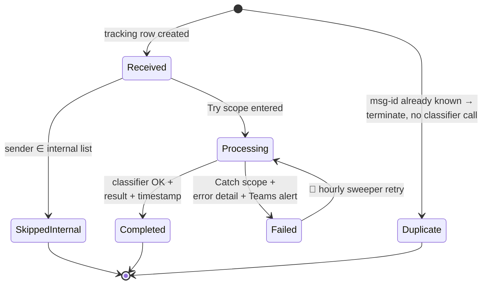

# We Wired an AI to a Personal Inbox. Here's Everything That Was Wrong With It

*A fragile, single-mailbox Power Automate flow fed our AI quote classifier — until an architecture review found ten defects. This is the full post-mortem, and the idempotent, team-wide redesign that replaced it.*

**In this article:** the five most common Power Automate email automation mistakes, how to use Exchange transport rules and a shared mailbox for team-wide intake, how a Dataverse alternate key gives you deduplication for free, and six best practices you can apply to any cloud flow today.

---

## Table of contents

1. [The quick win that became technical debt](#the-quick-win-that-became-technical-debt)
2. [Inside the original flow: how version 1 worked](#inside-the-original-flow-how-version-1-worked)
3. [5 Power Automate email automation mistakes to avoid](#5-power-automate-email-automation-mistakes-to-avoid)
4. [The redesign: a layered email intake architecture](#the-redesign-a-layered-email-intake-architecture)
5. [Inside the new flow: one run, step by step](#inside-the-new-flow-one-run-step-by-step)
6. [Old vs. new at a glance](#old-vs-new-at-a-glance)
7. [What the new architecture costs](#what-the-new-architecture-costs)
8. [6 Power Automate best practices you can steal](#6-power-automate-best-practices-you-can-steal)
9. [FAQ](#faq)

---

## The quick win that became technical debt

Like many teams experimenting with AI, ours started with a simple and seductive idea: customers email us requests for quotes, an AI classifier can read them, so let's wire the two together with **Power Automate email automation**.

The first version worked. A cloud flow watched a salesperson's Outlook inbox, stamped each email with a category (`Quote Process - Started`), filtered out internal chatter against a hardcoded domain list, and handed external emails to an AI intent classifier. When classification finished, the category flipped to `Quote Process - Complete`.

Demo-able in a week. Everyone was happy.

Then we looked closer.

## Inside the original flow: how version 1 worked

Before criticizing it, let's give version 1 a fair hearing — because on paper it sounds perfectly reasonable, and understanding *exactly* how it worked is what makes the redesign meaningful.

The flow was triggered by **"When a new email arrives (V3)"** on one salesperson's personal inbox, with every filter field left empty — folder `Inbox`, no sender filter, no subject filter, attachments ignored. From there, a single run did the following:

1. **Get the mailbox's master category list** — the flow needed the category *objects*, not just names, to apply them.
2. **Two parallel branches:**
   - **Branch A** filtered the list for `Quote Process - Started`, assigned that category to the message, then made a Graph call — `PATCH /v1.0/me/messages/{id}` with `{"categories": ["Quote Process - Started"]}` — to stamp it.
   - **Branch B** filtered the list for `Quote Process - Complete` (for later use), composed a **hardcoded array of 12 internal domains**, and evaluated a `contains(...)` expression against the sender's address.
3. **A condition** joined the branches: if the sender was internal → `Terminate`. If external → build a JSON payload and **call the child flow** `Ai Quote - 2 Parse Email to Intent Classifier`.
4. A final Graph call PATCHed the message's categories to `Quote Process - Complete`.



Notice the structural choices hiding in that diagram:

- **The categorization branch runs in parallel with the internal check** — so even internal emails get stamped "Started" and consume two Graph calls before the run terminates.
- **The state model has exactly two states** — `Started` and `Complete` — and both live as Outlook categories on the message itself. There is no third place that knows what happened. A failed classifier call leaves the email stamped `Started` forever, indistinguishable from one that's genuinely in progress.
- **The PATCH replaces the whole `categories` collection**, so any category the salesperson applied by hand is silently wiped.
- **Everything is bound to `/me/`** — the Graph calls only work against the connected user's own mailbox, which welds the whole design to one person.

None of these were bugs in the implementation. The flow did exactly what it was built to do. They were limitations of the *architecture* — and that distinction matters, because no amount of action-level fixing inside the same shape would have solved them.

Then we looked closer, and catalogued what that shape costs.

## 5 Power Automate email automation mistakes to avoid

Reviewing the flow months later, we catalogued ten distinct defects. Most of them trace back to five architectural smells worth recognizing in any **email automation project** — whether you build on Power Automate, Logic Apps, or anything else.

### Mistake 1: No trigger conditions — the flow fires for everything

The flow had **no trigger filtering at all**. Every newsletter, every Teams notification, every internal reply started a flow run. Filtering happened *inside* the run — after the platform had already burned a run against our **Power Platform API limits**, and after the email had already been categorized. For roughly 100 inbound emails, we paid for 100 runs to process maybe 30 real quotes.

**Why it happens:** the designer makes it natural. You pick the trigger, you add a Condition action, the flow works — and nothing on the canvas tells you those two filters are wildly different in cost. A Condition action evaluates *after* the run has started; a **trigger condition** (hidden under the trigger's *Settings → Trigger conditions*) evaluates *before* a run is even created.

**Why it hurts more than it looks:** the wasted runs aren't just noise. They count against your per-user/per-flow API request allocations, they bury real runs in the run history (making debugging genuinely harder), and in our case each junk run also fired two Graph calls to categorize an email we were about to ignore. Multiply by every mailbox-connected flow in the tenant and this pattern is one of the most common sources of mysterious throttling.

**The fix:** push filtering as far upstream as it can go. Trigger conditions are free — a filtered-out email costs literally zero runs. And anything that can be expressed as a mail-routing decision (sender domain, recipient group) can move even further upstream, into Exchange itself.

### Mistake 2: Using Outlook categories as a state store

Processing state lived in **Outlook categories** on the message. Categories are user-editable, non-transactional, and invisible to anything outside that one mailbox. A user tidying up their inbox could silently corrupt process state. Worse, the flow's category PATCH *replaced* the entire categories collection — wiping anything the user had applied manually.

**Why it happens:** categories are *right there*. They're visible in Outlook, they feel like status labels, and the connector can set them. For a demo, "the email turns green when it's done" is genuinely satisfying. The trap is that what reads as a UI nicety quietly becomes the system of record.

**Unpack the three failure modes:**

- **User-editable** — the "database" sits in a UI that its users are *supposed* to interact with. A salesperson clearing categories during inbox cleanup is not misuse; it's normal behavior that happens to destroy process state.
- **Non-transactional** — there's no compare-and-swap, no locking, no uniqueness. Two concurrent runs can both read "no category yet" and both proceed. You cannot build a reliable state machine on a property with no concurrency semantics.
- **Invisible externally** — no report, no other flow, no support engineer can query "which emails are stuck in Started?" without opening that one person's mailbox.

And the subtle killer: the Graph `PATCH` on `categories` replaces the **whole collection**, not just your label. Every write by the flow silently deleted whatever the human had applied.

If you remember one sentence from this article, make it this one: **your inbox is not a database.**

**The fix:** authoritative state goes in a real table (Dataverse in our case) with proper keys and timestamps. If you still want the visual nicety, apply categories *additively* — read, append, write — and treat them as disposable cosmetics.

### Mistake 3: No deduplication or idempotency

There was no **email deduplication** of any kind. A reply in the same thread? New classifier run. The platform retries a trigger? New classifier run. A race between two runs before the first one stamps the message? Both classify it. Every one of those is wasted AI spend at best, duplicated downstream side effects at worst.

(*Idempotent*, for precision: processing the same message N times must have exactly the same effect as processing it once. The pipeline doesn't need to prevent duplicate *deliveries* — it needs to make duplicate *processing* impossible.)

**Why it happens:** duplicates feel like an edge case, and during development they almost never show up — you send one test email, it processes once, looks perfect. But cloud triggers offer **at-least-once** semantics, not exactly-once: polling overlaps, transient failures cause redelivery, and the same physical message can legitimately arrive via multiple routes. Duplicates aren't an anomaly; they're a guarantee at scale.

**Why "checking first" isn't enough:** the intuitive fix — look up whether the message was already processed, then proceed — has a race window between the check and the write. Two runs triggered milliseconds apart both pass the check. Procedural care cannot close that window; only a **structural** mechanism can: a unique constraint that the platform itself enforces. With an alternate key on the message ID, the second writer *fails*, deterministically, and failure-on-duplicate becomes your dedup signal.

**The fix:** find the natural idempotency key of your domain — for email it's the **`Internet-Message-ID`** header and put a database-level uniqueness constraint on it. If you haven't met this header before: it's a globally unique identifier (e.g. `<CAF3x9...@mail.gmail.com>`) stamped on every message by the *sending* server, per RFC 5322 — which means it's identical on every delivered copy of the same message, across recipients, mailboxes, and transport-rule copies, but changes when a message is genuinely new (a reply, a manual forward). That's precisely the semantics a dedup key needs. Everything else (retries, multi-route delivery, races) collapses into "the second insert fails, terminate gracefully."

### Mistake 4: Binding the pipeline to a personal mailbox

The flow ran on a **personal connection to a personal mailbox**. If that person left the company, changed their password, or let the connection expire — quote intake simply stopped. And quotes emailed to any *other* salesperson never entered the pipeline at all. The architecture had no story for being a team.

**Why it happens:** every Power Automate connection starts as *somebody's* connection — building on your own identity is the path of least resistance, and there's no warning when a personal credential becomes load-bearing for a business process. This is how "citizen development" quietly produces single points of failure: the flow works for months, everyone forgets it exists, and then its owner goes on leave, changes their password, or hands in their notice.

**The two distinct problems hiding here:**

1. **Identity fragility** — the connection's lifetime is coupled to one human's account lifecycle (password resets, MFA changes, offboarding). The blast radius of an HR event is a production outage.
2. **Coverage gap** — a personal-inbox trigger sees exactly one mailbox. Customers don't know your org chart; they email whichever salesperson they have history with. Every quote sent to anyone else was simply invisible to the AI pipeline — not failed, *invisible*, which is worse because nobody knows it's missing.

**The fix:** business processes run on **service accounts** against **shared mailboxes** — identities owned by the organization, not a person. For the coverage gap, don't multiply flows per mailbox (N flows, N connections, N things to maintain); fan the mail in at the transport layer so one flow sees everything.

### Mistake 5: Silent failure with no error handling

No error handling. No scopes, no run-after configuration, no alerts. A failed classifier call left the email stamped "Started" forever, with no retry path and nobody notified. Flow run history — the only record of what happened — evaporates after 28 days.

**Why it happens:** the happy path is the demo path. Error handling in Power Automate — Scope blocks with "run after has failed" configuration — is possible but not *prompted*: nothing in the designer nudges you toward it, and a flow without it looks identical to one with it. So failure handling becomes the feature that's always planned for the next iteration.

**What silence actually costs:** the failure mode here isn't an error — it's a *missing outcome*. A customer's quote request arrives, the classifier hiccups, and… nothing. No alert, no retry, no record that anyone expected anything to happen. The customer follows up days later; the team scrambles; and the flow's run history — the only forensic evidence — has a 28-day retention clock running. An automation that fails loudly is an inconvenience; one that fails silently is a slow leak of exactly the business it was built to capture.

**The fix has three layers, each cheap:**

1. **Try/Catch structure** — wrap the risky work in a Scope; add a second Scope configured to run *after the first has failed or timed out*.
2. **Persist + alert** — the Catch writes a `Failed` status with the error detail to the tracking table and posts to an ops channel. Failure becomes a visible, attributed work item.
3. **A sweeper** — a small scheduled flow that re-submits anything stuck in an intermediate state for too long. This catches even the failures your Try/Catch never saw (e.g., the run that was killed mid-flight).

## The redesign: a layered email intake architecture

The fix wasn't a cleverer flow. It was moving each responsibility to the layer that's actually good at it:

```text
Exchange transport rule   →  routing and coarse filtering
Trigger conditions        →  fine filtering, before a run even exists
Dataverse                 →  state, deduplication, audit
The flow                  →  orchestration only
A scheduled sweeper       →  recovery
```

### Shared mailbox fan-in with an Exchange transport rule

Instead of one flow per mailbox (or one heroic mailbox), we let **Exchange Online** do the fan-in. An **Exchange transport rule** (mail flow rule) watches mail sent to any member of a sales security group, applies quote heuristics, and silently BCCs a copy to a **shared mailbox** — `quotes@`. The rep's copy stays untouched in their inbox.

#### What a transport rule actually is

A transport rule (officially a *mail flow rule*) is a piece of server-side logic that runs **inside the Exchange Online transport pipeline** — the path every message travels between sender and mailbox. While a message is in transit, Exchange evaluates each enabled rule in priority order; if the rule's conditions match (and no exception applies), Exchange executes its actions *before the message is ever delivered*.

Think of the transport pipeline as the **postal sorting office** of your tenant. Every email — inbound from the internet, outbound to customers, or internal between colleagues — physically passes through it on the way to its destination. A transport rule is an instruction you hand to the sorting office: *"whenever you see a letter that looks like this, do that with it."* The sorting office applies the instruction to every single letter, uniformly, regardless of whose mailbox it's headed for, whether that person is on holiday, or whether their laptop is on. Nothing has to run in the recipient's mailbox; the work happens centrally, before delivery.

A few properties follow directly from that position in the pipeline:

- **Organization-wide by default.** One rule covers the whole tenant. You scope it down with conditions (specific recipients, groups, domains, keywords) — you never have to "install" it per mailbox.
- **Synchronous and guaranteed.** The rule is evaluated as part of delivery itself. There is no polling interval, no missed trigger, no flow run that failed to start. If the message was delivered, the rule was evaluated.
- **Invisible to end users.** Users can't see, edit, or delete transport rules (unlike inbox rules they control), so the routing behavior can't be accidentally broken by someone tidying up their Outlook settings.
- **Composable.** Rules have priorities and are evaluated in order; an organization typically runs many of them side by side — disclaimers, compliance journaling, external-sender banners, and routing rules like ours.

Transport rules are built from a rich vocabulary of **conditions** (sender/recipient, group membership, subject or body keywords, header values, attachment properties, message size, sensitivity labels…), **exceptions** (the same vocabulary, negated), and **actions** (redirect, BCC, reject, prepend disclaimers, set headers, apply encryption, hold for moderation…). What we use here — match recipients in a group + keywords, then `BlindCopyTo` — is one small but powerful combination from that toolbox.

Common real-world uses you've almost certainly been on the receiving end of: the *"⚠ This email originated outside the organization"* banner, legal disclaimers appended to outbound mail, and compliance copies of certain traffic routed to an archive mailbox. Our quote-intake fan-in is exactly the last pattern, pointed at a shared mailbox instead of an archive.

#### The email flow, end to end

Here is the journey of a customer's quote email through the pipeline — including where the transport rule intercepts it and how the copy reaches the flow:



Read it top to bottom: whether the customer writes to a rep or to `quotes@` directly, the message passes the transport pipeline exactly once. If the rule matches, Exchange delivers **two copies of the same message** — the untouched original to the rep, the silent BCC to the shared mailbox. Only the shared-mailbox copy triggers the flow; and because every copy carries the same `Internet-Message-ID`, the Dataverse dedup guarantees the classifier runs exactly once no matter how many routes the message took.

This is fundamentally different from anything you can do in Power Automate or with inbox rules:

| | Inbox rule | Power Automate trigger | Transport rule |
|---|---|---|---|
| Runs | After delivery, per mailbox | After delivery, polled | **In transit, organization-wide** |
| Scope | One mailbox | One mailbox per connection | Every message through the tenant |
| Owner | End user (fragile) | Flow owner | Exchange admin (governed) |
| Can copy mail silently | No (visible forwards) | No (visible forwards) | **Yes (`BlindCopyTo`)** |
| Preserves message identity | — | — | **Yes — original headers intact** |

#### Anatomy of our rule

Every transport rule has three parts — **conditions**, **exceptions**, and **actions**:

- **Condition — who it applies to:** `SentToMemberOf: SG-Sales-Quotes@…` — a mail-enabled security group containing all sales reps. This is the scaling trick: the rule references the *group*, never individual people.
- **Refinement — what kind of mail:** `SubjectOrBodyContainsWords` ("quote", "quotation", "RFQ", localized variants). This is a heuristic, so it will need tuning — more on that below.
- **Exception — what to ignore:** sender address matches our own domains. Internal chatter never gets copied.
- **Action — what happens:** `BlindCopyTo: quotes@`. Exchange adds the shared mailbox as an invisible BCC recipient. The customer doesn't see it, the rep doesn't see it, and the rep's copy is completely untouched.

```powershell
New-TransportRule -Name "Quote intake - copy rep mail to shared mailbox" `
  -SentToMemberOf "SG-Sales-Quotes@domain.com" `
  -SubjectOrBodyContainsWords "quote","quotation","RFQ" `
  -ExceptIfSenderDomainIs "domain.com","domain-group.com" `
  -BlindCopyTo "quotes@domain.com" `
  -Mode Audit
```

#### Why "in transit" is the killer feature

Because the rule acts before delivery, the BCC copy is not a forward — it's the **same message**, delivered to one more recipient. Forwarding (by an inbox rule or a flow) creates a *new* message with a *new* `Internet-Message-ID`; the transport-rule copy keeps the **original `Internet-Message-ID` intact**. That single fact powers everything downstream:

- When a customer emails a rep *and* `quotes@` in the same message, both copies carry the same ID — the Dataverse dedup collapses them into one processing run.
- The copy also preserves the **original To/Cc recipients**, which is how the flow attributes each quote to the right rep without any extra integration.

#### Operational realities worth knowing

- **Propagation delay:** rule changes take up to ~30 minutes to apply across the tenant. Plan changes; don't expect instant effect.
- **Audit mode first:** `-Mode Audit` evaluates the rule and logs matches without acting. We run 1–2 weeks in Audit, review the mail-flow reports, tune the keyword list, then switch to `Enforce`. False positives are cheap anyway — the flow's own trigger conditions and internal-sender check act as a second net.
- **System mail is exempt:** NDRs, journal reports, and other system-generated messages are not processed by mail flow rules — free noise reduction.
- **It's admin territory:** transport rules live in the Exchange admin center, not in your solution. Script them in PowerShell (as above) so they're version-controlled and reproducible across environments, and budget for the change-management process.

Onboarding a new salesperson is now a group-membership change. No flow edits, no new connections, no rule edits.

### Dataverse deduplication with an alternate key

The new flow's first real action is a lookup against a **Dataverse tracking table** with an **alternate key on the Internet-Message-ID**. If a row exists, terminate — already handled. If two runs race, the second `Create` fails with a duplicate-key error, which the flow treats as "already handled."

This is **idempotency by construction**. Not "we check carefully," but "the platform makes double-processing structurally impossible." Replies, duplicate deliveries, trigger retries, the same message arriving via two routes — all collapse into exactly one classification run.

### Durable state and a free audit trail

Every email now gets a lifecycle row: `Received → Processing → Completed / Failed / SkippedInternal / Duplicate`, with sender, route, assigned rep, classifier result, timestamps, and error detail. That one table quietly delivers things the old design couldn't dream of:

- **Audit trail** with unlimited retention, queryable from anywhere
- **Power BI reporting** and per-rep pipeline views, essentially for free
- **Rep attribution** — because the transport-rule copy preserves the original recipients, the flow can tell *whose* customer sent each quote
- A natural anchor for follow-on automation: SLA escalation, CRM opportunity linkage, classifier feedback loops

Outlook categories still exist — but demoted to a cosmetic convenience, applied additively (read, append, PATCH), only in the shared mailbox. Removing one breaks nothing.

### Error handling in Power Automate: failure becomes a work item

The classification call sits in a Try scope. The Catch scope updates the row to `Failed` with error detail and pings an ops channel in Teams. An hourly sweeper flow picks up anything stuck in `Received` or `Processing` for over 30 minutes and resubmits it.

The failure mode changed from *"silently stuck email nobody knows about"* to *"visible, attributed, retryable work item."* That is, in my experience, the single biggest maturity jump any automation can make.

## Inside the new flow: one run, step by step

The transport rule handles routing; here is what the single intake flow actually does when a copy lands in `quotes@`:

1. **Trigger — with conditions.** "When a new email arrives in a shared mailbox (V2)", connected via the service account. Trigger conditions reject auto-generated mail (`X-Auto-Response-Suppress` header, `noreply` senders) **before a run is created** — those emails cost zero runs.
2. **Dedup lookup.** Query the tracking table for the trigger's `Internet-Message-ID`. Row found → `Terminate (Succeeded)`, reason: duplicate. The classifier is never invoked twice.
3. **Create the tracking row** with `status = Received`, plus everything we'll want to report on later: sender, sender domain, subject, conversation ID, and — derived from the preserved To/Cc recipients — `routedVia` (`Direct` or `RepCopy`) and the `assignedRep`.
4. **Internal check.** Sender domain compared against an **environment variable** (not a hardcoded array). Internal → row updated to `SkippedInternal`, terminate cleanly. No categories were harmed in the process.
5. **Try scope.** Row → `Processing`; call the intent classifier; row → `Completed` with the classifier result and timestamp; finally apply the cosmetic Outlook category — additively, in the shared mailbox only.
6. **Catch scope** (runs only if Try failed or timed out). Row → `Failed` with the error detail, Teams ops-channel notification, terminate as failed.
7. **Off-stage: the sweeper.** An hourly scheduled flow re-submits anything sitting in `Received`/`Processing` for more than 30 minutes.

The email's full lifecycle, as a state machine:



Compare that with the original's two-state model (`Started`, `Complete`, both as mailbox categories): six explicit states, every transition recorded with a timestamp, failure first-class and retryable, and all of it queryable from outside the mailbox.

## Old vs. new at a glance

| Dimension | 🔴 Original | 🟢 Redesign |
|---|---|---|
| Intake | One person's inbox | `quotes@` shared mailbox + transport-rule fan-in |
| Team coverage | 1 mailbox | Every member of the sales group |
| Trigger | Fires for every email | Trigger conditions — noise costs zero runs |
| Identity | Personal connection | Service account |
| State | 2 Outlook categories on the message | 6-state Dataverse lifecycle row |
| Dedup | None | Alternate key on `Internet-Message-ID` |
| Internal mail | Categorized first, terminated after (2 wasted Graph calls) | Filtered before the run, or `SkippedInternal` |
| Categories | Destructive PATCH (replaces all) | Additive, cosmetic, shared mailbox only |
| Config | Hardcoded 12-domain array | Environment variables |
| Failure | Silent, stuck "Started" forever | `Failed` + alert + sweeper retry |
| Audit | 28-day run history | Permanent, queryable, Power BI-ready |
| Onboard a salesperson | Not possible | Add to a security group |

We scored both designs across ten quality attributes — reliability, correctness, scalability, observability, operability, and friends. The original scored **19/50**; the redesign **44/50**, conceding points only on simplicity and licensing cost. All ten documented defects: resolved.

## What the new architecture costs

Honesty section. The new design is not free:

- **More moving parts.** A shared mailbox, a security group, a transport rule, a Dataverse table, and two flows — versus one flow before. More to document and hand over.
- **An Exchange admin dependency.** The transport rule lives outside the Power Platform team's control, with its own change process (and a ~30-minute propagation delay).
- **Premium licensing.** Dataverse actions make the flow premium. (In our case the AI child-flow architecture was likely premium already.)
- **Heuristic tuning.** Subject/body keyword conditions produce false copies and misses until tuned against real traffic. We run the rule in Audit mode first and let the flow's own filters act as a second net.

Worth it? Given the scorecard above — and the fact that the original's worst risks (single-person dependency, silent failure, duplicate AI spend) are business-continuity risks, not cosmetic ones — we think the answer is clearly yes.

## 6 Power Automate best practices you can steal

1. **Filter before the run exists.** Trigger conditions and transport-layer rules are free; flow runs are not.
2. **State belongs in a database, not in artifacts users can touch.** Categories, flags, folder moves — all fine as cosmetics, none acceptable as a source of truth.
3. **Idempotency should be structural, not procedural.** A unique key that *cannot* be violated beats any amount of careful checking.
4. **Never bind a business process to a personal identity.** Service accounts and shared mailboxes survive reorgs; people's passwords don't.
5. **Design the failure path first.** If a failed run is invisible, you don't have automation — you have a slow-motion incident generator.
6. **Use each layer for what it's good at.** Exchange routes mail better than Power Automate ever will. Dataverse enforces uniqueness better than your flow logic ever will.

The prototype-grade flow earned its keep: it proved the AI classifier was worth building around. But the moment an automation touches real revenue — and customer quotes are about as real as revenue gets — "it works on my mailbox" stops being an architecture.

## FAQ

### How do I deduplicate emails in Power Automate?

Store the email's `Internet-Message-ID` header in a Dataverse table with an **alternate key** on that column. Look the ID up before processing; if a row exists (or the Create fails with a duplicate-key error), the message has already been handled. This survives trigger retries, duplicate deliveries, and race conditions.

### Can one Power Automate flow monitor multiple mailboxes?

Not directly — but you don't need it to. Use an **Exchange transport rule** to BCC relevant mail from any number of mailboxes into a single shared mailbox, then point one flow (with a service-account connection) at that shared mailbox. Scaling becomes a security-group membership change.

### Should I use Outlook categories to track processing state?

No. Categories are user-editable, non-transactional, and scoped to one mailbox — and PATCHing them replaces the whole collection. Keep authoritative state in a database (Dataverse, SQL, etc.) and treat categories as a cosmetic convenience at most.

### Do trigger conditions reduce Power Automate API consumption?

Yes. Trigger conditions are evaluated **before a run is created**, so filtered-out emails consume no run at all — unlike a condition action inside the flow, which runs after the trigger has already fired and counted against your limits.

### What's the best way to handle errors in a cloud flow?

Wrap risky actions in a **Try scope**, add a **Catch scope** with "run after has failed/timed out," persist the failure (status + error detail) to a table, and alert an ops channel. Add a scheduled "sweeper" flow that retries items stuck in intermediate states.

---

*Have you inherited a flow that uses the inbox as a database? I'd love to hear your war stories in the comments. If this was useful, share it with the Power Platform admin who's about to wire an AI agent to someone's personal inbox.*

## References

- [Mail flow rules (transport rules) in Exchange Online — Microsoft Learn](https://learn.microsoft.com/en-us/exchange/security-and-compliance/mail-flow-rules/mail-flow-rules)
- [Mail flow rule actions in Exchange Online (`BlindCopyTo`) — Microsoft Learn](https://learn.microsoft.com/en-us/exchange/security-and-compliance/mail-flow-rules/mail-flow-rule-actions)
- [Manage mail flow rules in Exchange Online — Microsoft Learn](https://learn.microsoft.com/en-us/exchange/security-and-compliance/mail-flow-rules/manage-mail-flow-rules)
- [Best practices for configuring mail flow rules — Microsoft Learn](https://learn.microsoft.com/en-us/exchange/security-and-compliance/mail-flow-rules/configuration-best-practices)
- [`New-TransportRule` cmdlet reference — Microsoft Learn](https://learn.microsoft.com/en-us/powershell/module/exchange/new-transportrule)
- [Shared mailboxes in Exchange Online — Microsoft Learn](https://learn.microsoft.com/en-us/exchange/collaboration-exo/shared-mailboxes)
- [Define alternate keys to reference rows (Dataverse) — Microsoft Learn](https://learn.microsoft.com/en-us/power-apps/maker/data-platform/define-alternate-keys-reference-records)
- [Trigger conditions in Power Automate — Microsoft Learn](https://learn.microsoft.com/en-us/power-automate/triggers-introduction#customize-a-trigger-by-adding-conditions)
- [Requests and limits in Power Platform — Microsoft Learn](https://learn.microsoft.com/en-us/power-platform/admin/api-request-limits-allocations)
- [Environment variables in solutions — Microsoft Learn](https://learn.microsoft.com/en-us/power-apps/maker/data-platform/environmentvariables)
- [Error handling with scopes and run-after (Try/Catch pattern) — Microsoft Learn](https://learn.microsoft.com/en-us/power-automate/error-handling)
